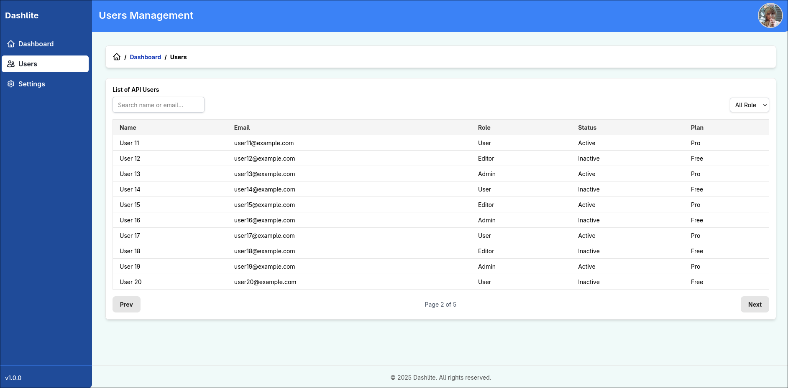

# Dashlite

Dashlite is a simple **React-based** dashboard template built with a focus on speed and lightweight performance.
This project uses **Tailwind CSS**, **Heroicons**, and **Recharts** as the core UI foundation, and leverages **React Suspense & Lazy** for component loading optimization.

## Live Demo

> https://dashlite-eight.vercel.app/login

## Screenshot





## Key Components

- Flexible **Sidebar & Navbar** (navigation data, titles, and actions can be passed externally).
- **Automatic breadcrumbs** based on URL.
- **Loader spinner** for loading states.
- **Alert** with enter & exit animations.
- **Ready-to-use pages**:
  - Dashboard (demo chart using Recharts).
  - Users (table with pagination, search, and filters).
  - Settings (theme, font size, API name, maintenance mode).
  - Account (admin profile, email, username, forgot password).
  - Notifications (list with mark-as-read).
  - HTTP Response Status Code.
  - Forgot Password.

## Technologies

- [React](https://reactjs.org/)
- [Tailwind CSS](https://tailwindcss.com/)
- [Heroicons](https://heroicons.com/)
- [Recharts](https://recharts.org/en-US/)
- React Router (navigation)
- Suspense & React.lazy (code splitting)

## Project Structure

This project uses a hybrid folder structure combining the Atomic Design pattern with a modular architecture

```
src/
├── modules/
│ ├── auth/       # Feature for auth pages
│ └── dashboard/  # Feature for dashboard pages
├── pages/        # Pages (Dashboard, Users, Settings, etc.)
├── routes/       # Main routing
├── shared/       # Global components
├── types/        # Global types
├── utils/        # Global utils
├── App.tsx
└── index.tsx
```

## Installation & Running

1. Clone the repo:

   ```bash
   git clone https://github.com/Daffabot/dashlite.git
   cd dashlite
   ```

2. Install dependencies:

   ```bash
   npm install
   ```

   ### or

   ```bash
   yarn install
   ```

3. Start the development server:

   ```bash
   npm run dev
   ```

   ### or

   ```bash
   yarn dev
   ```

4. Open in your browser:

   ```
   http://localhost:5173
   ```

5. Login with this accounts:

   -  Role: user
   
      email: ```user@example.com```

   -  Role: admin

      email: ```admin@example.com```

   -  Role: owner

      email: ```owner@example.com```

   all password accounts is ```123456```

## License

This project is released under the MIT License.
You are free to use, modify, and distribute it as needed.

## Contribution

Contributions are very welcome — whether adding new features, fixing bugs, or improving performance.
Feel free to open an issue or submit a pull request.
